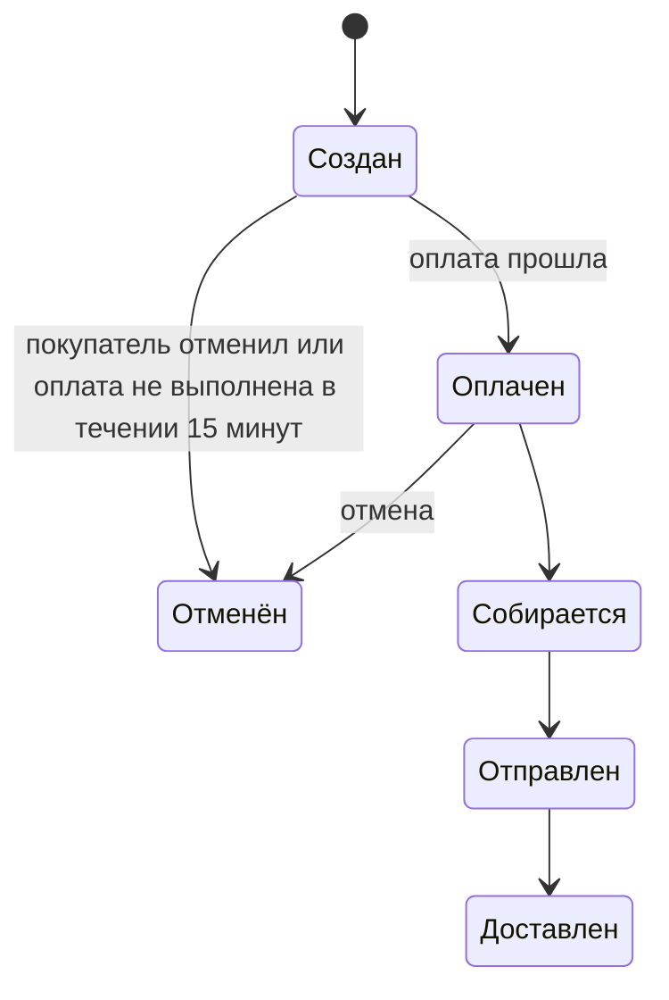

# Роли и права доступа

## Жизненный цикл заказа:

## Статус заказа: Создан ⮕ Оплачен ⮕ Собирается ⮕ Отправлен ⮕ Доставлен

## Покупатель
### МОЖЕТ:
- Зарегестрировать, изменить, удалить свой профиль
- Просматривать каталог товаров
- Создать заказ
- Видит только свои заказы
- Может отменить заказ до статуста "Отправлен", соответственно оплата возвращается

### НЕ МОЖЕТ:
- Просматривать чужие заказы и профили
- Создавать, изменять, удалять карточки товаров

## Менеджер
### МОЖЕТ:
- Просматривать заказы покупателей и их профиль
- Изменяет статусы заказа(собирается, отправлен, доставлен)
- Видит товары и их количество на складе
- Вернуть оплату за отмененный заказ
- Принимать товары на склад и обновлять количество
- Видит аналитику продаж

### НЕ МОЖЕТ:
- Создавать, изменять(только статус заказа), удалять заказ клиента
- Изменять карточки товаров и их цену
- Создавать учетные записи
- 

## Админ
### МОЖЕТ:
- Имеет все права доступа
- Создавать учетный записи для менеджера
- Полный доступ к скаду, изменение, удаление и создание товаров и цен

### НЕ МОЖЕТ:
- 
