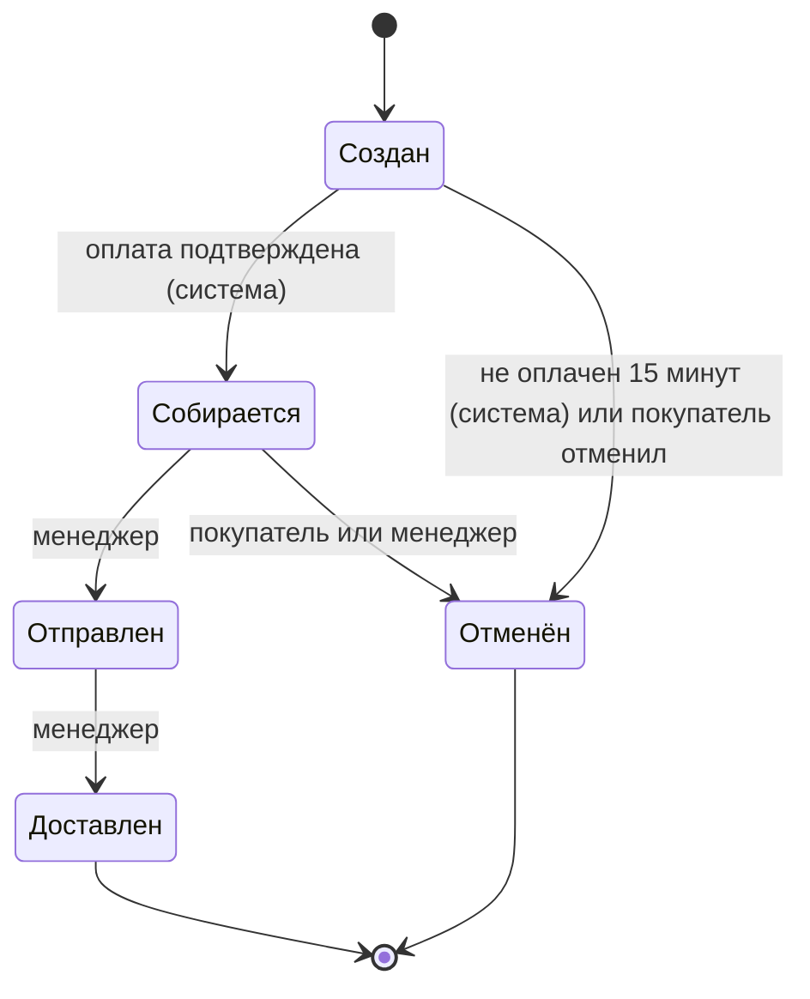
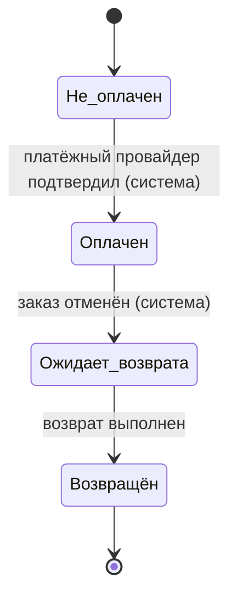

# Роли и права доступа

## Принципы

- **Наименьшие привилегии.** Каждая роль получает только то, что нужно для её работы.
- **Роль при регистрации всегда «Покупатель».** Аккаунты менеджеров создаёт только админ. Первого админа создаёт разработчик через сидер или консольную команду, через API это сделать нельзя.
- **Проверка прав на сервере.** Скрытая кнопка в интерфейсе защитой не считается. Каждый эндпоинт проверяет роль и принадлежность данных (покупатель обращается только к своим заказам).
- **История важна.** Смены статусов и цен записываются: кто, когда, что изменил, из какого значения в какое.

## Роли

| Роль | Кто это |
|------|---------|
| Гость | Неавторизованный посетитель |
| Покупатель | Зарегистрированный клиент |
| Менеджер | Сотрудник, обрабатывающий заказы и склад |
| Админ | Управляет каталогом, ценами и аккаунтами менеджеров |
| Система | Не аккаунт, а автоматические действия приложения |

## Жизненный цикл заказа

У заказа два независимых статуса: **статус заказа** (где он в процессе) и **статус оплаты** (что с деньгами). Заказ может перейти в «Собирается» только при статусе оплаты «Оплачен».

### Статус заказа

### Статус оплаты

### Таблица переходов заказа

| Из | В | Кто | Что происходит |
|----|---|-----|----------------|
| Создан | Собирается | Система | Оплата подтверждена, остатки уже зарезервированы, запись в историю |
| Создан | Отменён | Система или покупатель | Резерв снимается, возврат не нужен, запись в историю |
| Собирается | Отправлен | Менеджер | Резерв списывается со склада, уведомление покупателю |
| Собирается | Отменён | Покупатель или менеджер | Остатки возвращаются на склад, оплата переходит в «Ожидает возврата», уведомление, причина обязательна |
| Отправлен | Доставлен | Менеджер | Запись в историю |

Из статусов «Отправлен», «Доставлен» и «Отменён» отмена невозможна.

### Склад

- При создании заказа товар **резервируется**: нельзя заказать больше, чем доступно.
- При отмене резерв возвращается на склад.
- Цена товара копируется в позицию заказа в момент создания, поэтому смена цены не влияет на старые заказы.

## Гость

### МОЖЕТ
- Просматривать каталог товаров
- Зарегистрироваться и войти

### НЕ МОЖЕТ
- Создавать заказы
- Видеть любые личные данные

## Покупатель

### МОЖЕТ
- Просматривать каталог товаров
- Редактировать свой профиль (имя, телефон, адрес)
- Создавать заказ
- Видеть только свои заказы и историю их статусов
- Отменять свой заказ в статусах «Создан» и «Собирается»
- Удалить свой профиль (см. правила ниже)

### НЕ МОЖЕТ
- Видеть чужие заказы и профили
- Отменять заказ в статусах «Отправлен» и «Доставлен»
- Менять статусы заказа, кроме отмены
- Создавать, изменять и удалять карточки товаров
- Менять свою роль

### Удаление профиля
- Нельзя удалить профиль, пока есть заказы в статусах «Создан», «Собирается», «Отправлен».
- Заказы и платежи не стираются из базы: персональные данные в профиле обезличиваются, а сами записи остаются для учёта и аналитики.

## Менеджер

### МОЖЕТ
- Видеть заказы и контактные данные покупателей **только по заказам в работе** (Создан, Собирается, Отправлен)
- Переводить заказ: Собирается → Отправлен → Доставлен
- Отменять заказы в статусах «Создан» и «Собирается» с обязательной причиной (например, товара нет на складе)
- Подтверждать и контролировать возвраты по заказам со статусом оплаты «Ожидает возврата»
- Видеть остатки на складе, принимать поставки и обновлять количество
- Видеть аналитику продаж

### НЕ МОЖЕТ
- Создавать заказы и редактировать их содержимое
- Менять статус заказа в обход схемы переходов
- Изменять карточки товаров и цены
- Создавать и менять учётные записи
- Видеть контакты покупателей по завершённым и отменённым заказам

### Споры по заказам
Спорные вопросы покупателя (потерялся заказ, брак) обрабатывает менеджер. У админа доступа к заказам нет.

## Админ

### МОЖЕТ
- Создавать, изменять, блокировать и удалять учётные записи менеджеров
- Блокировать аккаунты покупателей
- Создавать и редактировать карточки товаров
- Изменять цены (каждое изменение записывается в историю: кто, когда, старая и новая цена)
- Архивировать товары
- Видеть аналитику без персональных данных покупателей

### НЕ МОЖЕТ
- Видеть заказы и контактные данные покупателей
- Отменять заказы и менять их статусы
- Изменять историю статусов и цен
- Создавать других админов через интерфейс или API
- Менять остатки на складе (это зона менеджера)

## Система (автоматические действия)

Системы нет в таблице пользователей, её действия в истории помечаются как «изменено системой».

| Событие | Действие |
|---------|----------|
| Платёжный провайдер сообщил об успешной оплате | Статус оплаты → «Оплачен», заказ → «Собирается» |
| Заказ не оплачен 15 минут | Заказ → «Отменён», резерв снимается |
| Заказ отменён при статусе оплаты «Оплачен» | Статус оплаты → «Ожидает возврата» |
| Смена статуса | Уведомление покупателю через очередь, запись в историю |

**Безопасность.** Уведомление об оплате приходит на публичный адрес, поэтому приложение обязано проверять подпись запроса, которую выдаёт платёжный провайдер. Без проверки любой человек может отправить «оплата прошла».

## Принятые решения 

1. **Оплата только онлайн.** Оплату при получении в первую версию не включаю: она добавляет статус оплаты после «Доставлен» и сценарий отказа от заказа.
2. **Отмена отправленного заказа невозможна.** Отказ от получения (возврат) оставляю на будущее.
3. **Админ без доступа к заказам.** Это снижает ущерб при взломе аккаунта админа.
4. **Товары архивируются, а не удаляются**, чтобы не ломать старые заказы.
5. **Менеджер видит контакты только по заказам в работе**, чтобы не хранить у сотрудников доступ ко всей базе клиентов.
6. **Возврат запускает система, менеджер контролирует.** Менеджер вмешивается, если возврат завис.

